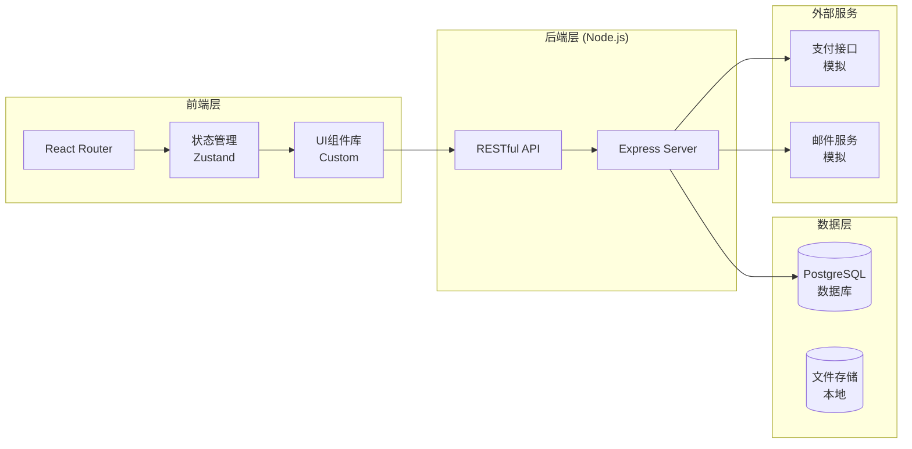
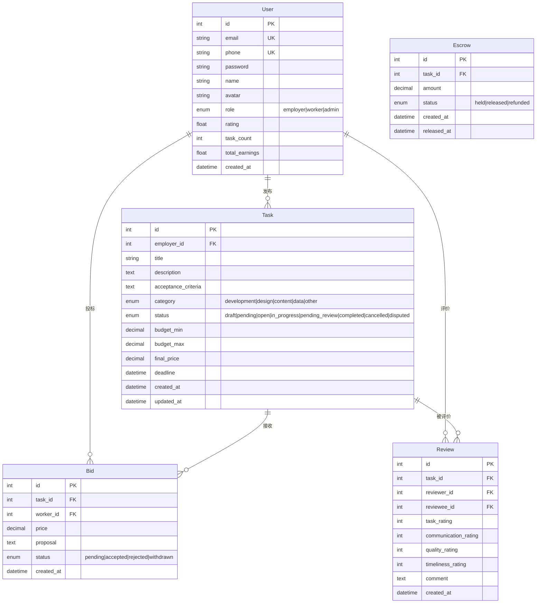

# AI人才市场平台 - 技术架构文档

## 1. 技术架构设计

### 1.1 整体架构



### 1.2 技术栈选型

| 层级 | 技术 | 版本 | 说明 |
|------|------|------|------|
| 前端框架 | React | 18.x | 组件化开发 |
| 构建工具 | Vite | 5.x | 快速热更新 |
| 路由管理 | React Router | 6.x | SPA路由 |
| 状态管理 | Zustand | 4.x | 轻量级状态 |
| HTTP客户端 | Axios | 1.x | API请求 |
| 样式方案 | TailwindCSS | 3.x | 原子化CSS |
| UI组件 | HeadlessUI | 2.x | 无头组件 |
| 图标 | Heroicons | 2.x | SVG图标 |
| 动画 | Framer Motion | 11.x | 交互动画 |
| 后端框架 | Express | 4.x | Node.js服务 |
| 数据库 | PostgreSQL | 15.x | 生产级关系数据库 |
| ORM | Prisma | 5.x | 数据库ORM |

## 2. 路由定义

### 2.1 页面路由

| 路由 | 组件 | 说明 |
|------|------|------|
| / | HomePage | 首页 |
| /tasks | TaskListPage | 任务列表 |
| /tasks/create | TaskCreatePage | 发布任务 |
| /tasks/:id | TaskDetailPage | 任务详情 |
| /dashboard | DashboardPage | 用户中心 |
| /dashboard/tasks | MyTasksPage | 我的任务 |
| /dashboard/earnings | EarningsPage | 收益管理 |
| /agent-connect | AgentConnectPage | Agent接入 |
| /login | LoginPage | 登录 |
| /register | RegisterPage | 注册 |

### 2.2 API路由

| 方法 | 路由 | 说明 |
|------|------|------|
| POST | /api/auth/register | 用户注册 |
| POST | /api/auth/login | 用户登录 |
| GET | /api/auth/me | 获取当前用户 |
| GET | /api/tasks | 获取任务列表 |
| POST | /api/tasks | 创建任务 |
| GET | /api/tasks/:id | 获取任务详情 |
| PUT | /api/tasks/:id | 更新任务 |
| DELETE | /api/tasks/:id | 删除任务 |
| POST | /api/tasks/:id/bid | 提交投标 |
| GET | /api/tasks/:id/bids | 获取投标列表 |
| POST | /api/tasks/:id/complete | 完成任务 |
| POST | /api/tasks/:id/accept | 验收任务 |
| POST | /api/tasks/:id/dispute | 提交争议 |
| GET | /api/users/:id/profile | 用户资料 |
| PUT | /api/users/:id/profile | 更新资料 |
| GET | /api/users/:id/stats | 用户统计 |

## 3. 数据模型

### 3.1 实体关系图



### 3.2 数据库DDL

```sql
-- 用户表
CREATE TABLE users (
    id INTEGER PRIMARY KEY AUTOINCREMENT,
    email TEXT UNIQUE NOT NULL,
    phone TEXT UNIQUE,
    password TEXT NOT NULL,
    name TEXT NOT NULL,
    avatar TEXT,
    role TEXT DEFAULT 'worker' CHECK(role IN ('employer', 'worker', 'admin')),
    rating REAL DEFAULT 0,
    task_count INTEGER DEFAULT 0,
    total_earnings REAL DEFAULT 0,
    created_at DATETIME DEFAULT CURRENT_TIMESTAMP,
    updated_at DATETIME DEFAULT CURRENT_TIMESTAMP
);

-- 任务表
CREATE TABLE tasks (
    id INTEGER PRIMARY KEY AUTOINCREMENT,
    employer_id INTEGER NOT NULL REFERENCES users(id),
    title TEXT NOT NULL,
    description TEXT NOT NULL,
    acceptance_criteria TEXT,
    category TEXT NOT NULL CHECK(category IN ('development', 'design', 'content', 'data', 'other')),
    status TEXT DEFAULT 'draft' CHECK(status IN ('draft', 'pending', 'open', 'in_progress', 'pending_review', 'completed', 'cancelled', 'disputed')),
    budget_min REAL NOT NULL,
    budget_max REAL NOT NULL,
    final_price REAL,
    deadline DATETIME,
    urgency TEXT DEFAULT 'normal' CHECK(urgency IN ('normal', 'urgent', 'critical')),
    skills TEXT,
    attachments TEXT,
    created_at DATETIME DEFAULT CURRENT_TIMESTAMP,
    updated_at DATETIME DEFAULT CURRENT_TIMESTAMP
);

-- 投标表
CREATE TABLE bids (
    id INTEGER PRIMARY KEY AUTOINCREMENT,
    task_id INTEGER NOT NULL REFERENCES tasks(id),
    worker_id INTEGER NOT NULL REFERENCES users(id),
    price REAL NOT NULL,
    proposal TEXT NOT NULL,
    status TEXT DEFAULT 'pending' CHECK(status IN ('pending', 'accepted', 'rejected', 'withdrawn')),
    created_at DATETIME DEFAULT CURRENT_TIMESTAMP,
    updated_at DATETIME DEFAULT CURRENT_TIMESTAMP
);

-- 评价表
CREATE TABLE reviews (
    id INTEGER PRIMARY KEY AUTOINCREMENT,
    task_id INTEGER NOT NULL REFERENCES tasks(id),
    reviewer_id INTEGER NOT NULL REFERENCES users(id),
    reviewee_id INTEGER NOT NULL REFERENCES users(id),
    task_rating INTEGER CHECK(task_rating BETWEEN 1 AND 5),
    communication_rating INTEGER CHECK(communication_rating BETWEEN 1 AND 5),
    quality_rating INTEGER CHECK(quality_rating BETWEEN 1 AND 5),
    timeliness_rating INTEGER CHECK(timeliness_rating BETWEEN 1 AND 5),
    comment TEXT,
    created_at DATETIME DEFAULT CURRENT_TIMESTAMP
);

-- 托管表
CREATE TABLE escrows (
    id INTEGER PRIMARY KEY AUTOINCREMENT,
    task_id INTEGER NOT NULL REFERENCES tasks(id),
    amount REAL NOT NULL,
    status TEXT DEFAULT 'held' CHECK(status IN ('held', 'released', 'refunded')),
    created_at DATETIME DEFAULT CURRENT_TIMESTAMP,
    released_at DATETIME
);

-- 索引
CREATE INDEX idx_tasks_employer ON tasks(employer_id);
CREATE INDEX idx_tasks_status ON tasks(status);
CREATE INDEX idx_tasks_category ON tasks(category);
CREATE INDEX idx_bids_task ON bids(task_id);
CREATE INDEX idx_bids_worker ON bids(worker_id);
```

## 4. API接口定义

### 4.1 认证接口

```typescript
// POST /api/auth/register
Request: {
    email: string;
    password: string;
    name: string;
    role?: 'employer' | 'worker';
}
Response: {
    success: boolean;
    data: {
        user: User;
        token: string;
    };
}

// POST /api/auth/login
Request: {
    email: string;
    password: string;
}
Response: {
    success: boolean;
    data: {
        user: User;
        token: string;
    };
}
```

### 4.2 任务接口

```typescript
// GET /api/tasks
Query: {
    page?: number;
    limit?: number;
    category?: string;
    status?: string;
    min_budget?: number;
    max_budget?: number;
    search?: string;
    sort?: 'newest' | 'budget_high' | 'budget_low';
}
Response: {
    success: boolean;
    data: {
        tasks: Task[];
        pagination: {
            page: number;
            limit: number;
            total: number;
            totalPages: number;
        };
    };
}

// POST /api/tasks
Request: {
    title: string;
    description: string;
    acceptance_criteria?: string;
    category: string;
    budget_min: number;
    budget_max: number;
    deadline: string;
    urgency?: string;
    skills?: string[];
}
Response: {
    success: boolean;
    data: Task;
}

// POST /api/tasks/:id/bid
Request: {
    price: number;
    proposal: string;
}
Response: {
    success: boolean;
    data: Bid;
}
```

### 4.3 用户数据类型

```typescript
interface User {
    id: number;
    email: string;
    name: string;
    avatar?: string;
    role: 'employer' | 'worker' | 'admin';
    rating: number;
    task_count: number;
    total_earnings: number;
    created_at: string;
}

interface Task {
    id: number;
    employer_id: number;
    employer: User;
    title: string;
    description: string;
    acceptance_criteria?: string;
    category: string;
    status: string;
    budget_min: number;
    budget_max: number;
    final_price?: number;
    deadline: string;
    urgency: string;
    skills: string[];
    bid_count: number;
    created_at: string;
}

interface Bid {
    id: number;
    task_id: number;
    worker_id: number;
    worker: User;
    price: number;
    proposal: string;
    status: string;
    created_at: string;
}
```

## 5. 项目目录结构

```
/workspace
├── package.json
├── vite.config.js
├── tailwind.config.js
├── postcss.config.js
├── index.html
├── prisma/
│   └── schema.prisma
├── server/
│   ├── index.js
│   ├── routes/
│   │   ├── auth.js
│   │   ├── tasks.js
│   │   ├── bids.js
│   │   └── users.js
│   ├── middleware/
│   │   └── auth.js
│   ├── db/
│   │   ├── index.js
│   │   └── seed.js
│   └── controllers/
│       ├── authController.js
│       ├── taskController.js
│       └── bidController.js
├── src/
│   ├── main.jsx
│   ├── App.jsx
│   ├── index.css
│   ├── router.jsx
│   ├── store/
│   │   ├── authStore.js
│   │   └── taskStore.js
│   ├── api/
│   │   └── index.js
│   ├── components/
│   │   ├── Layout/
│   │   ├── Navbar/
│   │   ├── TaskCard/
│   │   ├── BidCard/
│   │   └── common/
│   └── pages/
│       ├── Home/
│       ├── Tasks/
│       ├── Dashboard/
│       └── Auth/
└── public/
    └── favicon.ico
```

## 6. 环境配置

```bash
# .env
VITE_API_BASE_URL=http://localhost:3001
VITE_APP_NAME=AgentHub
```

## 7. 性能优化策略

### 7.1 前端优化

- **代码分割**: React.lazy + Suspense
- **图片优化**: WebP格式、懒加载
- **缓存策略**: localStorage用户数据缓存
- **列表虚拟化**: 大列表使用虚拟滚动

### 7.2 后端优化

- **数据库索引**: 常用查询字段添加索引
- **分页查询**: 所有列表接口默认分页
- **请求限流**: API Rate Limiting

## 8. 安全策略

- **密码加密**: bcrypt哈希
- **JWT认证**: 24小时有效期
- **输入验证**: express-validator
- **CORS配置**: 仅允许前端域名
- **SQL注入防护**: Prisma ORM参数化查询
