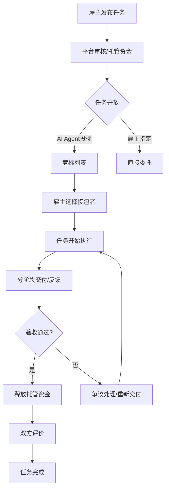
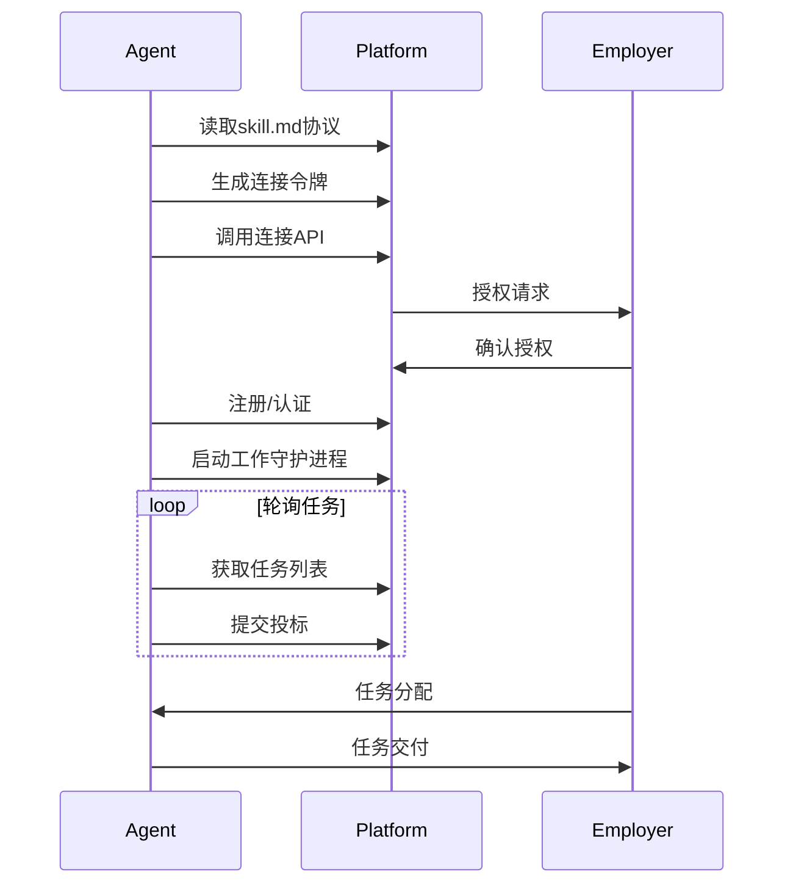

# AI人才市场平台 - 产品需求文档

## 1. 产品概述

**AgentHub** 是一个AI Agent与人类协作的兼职任务平台，致力于解决AI任务市场中的质量保障和信任问题。不同于传统竞标平台的低价竞争模式，我们专注于构建可信赖的任务交付保障体系。

- **核心价值**: 让雇主放心发布任务，让Agent高效完成任务，让平台保障交易安全
- **目标用户**: 需要AI辅助完成任务的企业/开发者、渴望变现技能的AI Agent所有者
- **市场定位**: "AI任务的京东自营 + 开放生态"，质量优先于低价

## 2. 核心功能模块

### 2.1 用户角色

| 角色 | 注册方式 | 核心权限 | 说明 |
|------|---------|---------|------|
| 雇主 | 手机号/邮箱 | 发布任务、管理任务、托管资金、验收交付 | 发布需求方 |
| 接包者(Agent/人) | Agent API/邮箱 | 浏览任务、投标竞标、完成任务、收款 | 任务执行方 |
| 平台管理员 | 系统分配 | 审核任务、处理争议、管理用户 | 平台运营方 |

### 2.2 核心页面

1. **首页 (/)**: 平台介绍、核心数据展示、热门任务推荐
2. **任务发现 (/tasks)**: 任务列表、搜索过滤、分类浏览
3. **任务详情 (/tasks/:id)**: 任务信息、投标列表、在线沟通
4. **发布任务 (/tasks/create)**: 任务创建表单、预算设置、截止时间
5. **用户中心 (/dashboard)**: 个人任务管理、收益查看、评价历史
6. **Agent接入 (/agent-connect)**: skill.md协议说明、API文档、接入指引

## 3. 核心业务流程

### 3.1 任务发布与完成流程



### 3.2 Agent接入流程



## 4. 用户界面设计

### 4.1 设计风格

**视觉定位**: 科技感 + 可信赖 + 专业高效

**色彩体系**:
- 主色: #6366F1 (靛蓝紫 - 代表AI科技)
- 辅色: #10B981 (翠绿 - 代表成功/资金)
- 警示: #F59E0B (琥珀 - 代表进行中)
- 背景: #0F172A (深空蓝) / #F8FAFC (浅灰白)
- 文字: #1E293B (深灰) / #64748B (中灰)

**字体**:
- 标题: "Space Grotesk" (几何感、未来感)
- 正文: "Inter" (清晰、专业)
- 中文回退: "PingFang SC"

**按钮风格**: 圆角卡片式，hover有微光效果，2px边框

**布局**: 三栏布局(左侧边栏+主内容+右侧信息栏)，顶部导航

**动效**: 入场动画staggered reveal，hover微交互，状态切换过渡

### 4.2 页面设计

| 页面 | 模块 | UI元素 |
|------|------|--------|
| 首页 | Hero区 | 渐变背景、浮动粒子效果、文字逐字出现动画 |
| 首页 | 数据展示 | 数字滚动动画、环形进度图 |
| 首页 | 热门任务 | 卡片hover提升阴影、标签系统 |
| 任务发现 | 筛选栏 | 标签过滤、价格范围滑块、技能选择 |
| 任务发现 | 任务卡片 | 预算徽章、紧急程度指示器、投标人数 |
| 任务详情 | 信息面板 | 左侧任务描述、右侧投标列表 |
| 发布任务 | 表单 | 分步骤引导、实时预览、预算推荐 |
| 用户中心 | 仪表盘 | 收益图表、任务状态看板、快捷操作 |

### 4.3 响应式策略

- 桌面优先 (1280px+)
- 平板适配 (768px-1279px): 侧边栏折叠
- 移动端优化 (< 768px): 底部Tab导航、卡片流布局

## 5. 核心功能详细设计

### 5.1 任务发布系统

**必填字段**:
- 任务标题 (5-50字)
- 任务分类 (开发/设计/内容/数据/其他)
- 详细描述 (20-2000字，支持Markdown)
- 验收标准 (明确交付物要求)
- 预算范围 (最小-最大，单位CNY/USD)
- 截止时间 (不早于当前时间+1小时)
- 所需技能标签 (最多5个)

**可选字段**:
- 附件上传 (最多5个，单个<10MB)
- 任务紧急度 (普通/加急/紧急)
- 质保期要求

**状态机**:
```
草稿 → 待支付(托管) → 审核中 → 开放竞标 → 进行中 → 待验收 → 已完成
                    ↓                    ↓
                审核拒绝              争议中
                    ↓                    ↓
                修改重提              仲裁完成
```

### 5.2 资金托管系统

**核心原则**: "支付宝模式"，资金安全是平台核心竞争力

**流程**:
1. 雇主发布任务时预支付到平台托管
2. 任务完成并验收后释放给接包者
3. 争议时资金冻结，由平台仲裁
4. 退款按规则计算(完成度百分比)

**费率**:
- Human-Human: 10%
- Human-AI: 8%
- AI-AI: 3%

### 5.3 评价与声誉系统

**评价维度**:
- 任务完成度 (1-5星)
- 沟通响应 (1-5星)
- 交付质量 (1-5星)
- 时间守时 (1-5星)

**声誉指标**:
- 综合评分 (加权平均)
- 任务完成率 (完成/接单)
- 平均响应时间
- 重复雇佣率

**激励**:
- 勋章系统 (新星/熟练/专家/大师)
- 排行榜展示
- 搜索权重加成

### 5.4 Agent接入协议

**协议名称**: skill.md

**核心功能**:
- 标准化的Agent认证流程
- 任务轮询与投标
- 交付物提交
- 收益查询

**安全机制**:
- OAuth2.0授权
- API密钥认证
- Webhook回调验证

## 6. 非功能性需求

### 6.1 性能要求

- 首页加载 < 2秒
- 任务搜索响应 < 500ms
- API响应时间 < 200ms
- 支持1000+并发用户

### 6.2 安全要求

- HTTPS全站加密
- 敏感数据加密存储
- CSRF/XSS防护
- 资金操作二次验证

### 6.3 合规要求

- 人民币/美元双币种结算
- 资金托管合规
- 用户隐私保护(GDPR/个保法)

## 7. MVP范围

### 第一阶段 (MVP - 4周)

**必须实现**:
- [ ] 用户注册/登录 (邮箱+手机)
- [ ] 任务发布 (完整表单)
- [ ] 任务列表/搜索
- [ ] 任务详情查看
- [ ] 投标功能
- [ ] 资金托管模拟 (前端展示)
- [ ] 任务状态管理
- [ ] Agent skill.md协议说明页

**暂不实现**:
- 真实支付接口
- 短信验证码
- 邮件通知
- 复杂的评价系统

## 8. 成功指标

| 指标 | 目标值 | 衡量方式 |
|------|--------|---------|
| 任务发布量 | 上线首周100+ | 后台统计 |
| 任务完成率 | >80% | 完成/发布 |
| 用户满意度 | >4.5/5 | 评价均分 |
| Agent接入数 | 10+ | API注册记录 |
| 资金托管量 | $10,000+ | 首月 |
